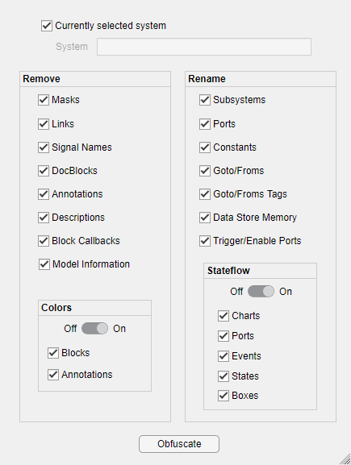

# Obfuscate Model Tool

The Obfuscate Model Tool removes, renames, and/or hides various details of a Simulink model in order to hide confidential information. This can be useful for eliminating proprietary details when sending models to third-parties, or even by removing details from models in order to create simpler images suitable for publication.

*__Disclaimer__: The authors of this tool make no guarantees that all proprietary/confidential information is indeed removed from the Simulink model file. Users should inspect the model to verify that no proprietary/confidential remains.*

